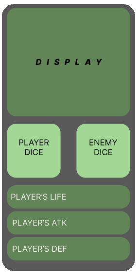
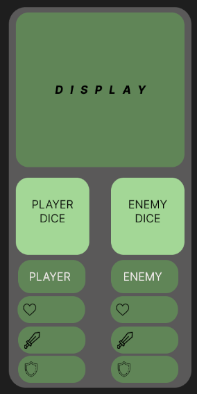

# Dungeon crawler web

# **DAY 00**    <h3> February 14, 2024 </h3>

The idea of ​​this repository is to develop a web application, so that the user can play a solo adventure based on the solo RPG Berdolock Fortress

##### **Observation: I will write step by step of process in English, as way to practice and lear the language**

## THE CUSTOMER
For this project, a fiction client needs a website where the person can play a solo RPG, but the application needs to be built only with HTML, CSS and Vanilla Javascript.
In the game the player has three possibilites:
  -Movement (section,meeting,treasure or trap)
  -Battle / damage (combat initiative,)
  -Escape (after thirty (30) rounds)

*REQUIREMENTS*
<ul>
  <li>-The player need to roller a dice;
</li>
  <li>-The enemy need to roller a dice and player need a see this result
</li>
</ul>

# **DAY 01** 
  <h3>February 15, 2024</h3>
  
  ## The Adventure Start

  The first step was to create  a layout  to test aplication 

  

  You can view in [RPG SOLO](https://gabrielsabreu.github.io/rpg.solo/)

# **DAYs 02, 03, 04 and 05**
  <h3>February 20, 22, 23 and 27, 2024</h3>
  
  ## Multiple number 1s in the dice

  This days I work in configured the layout.
  In first time working in struture HTML, thing about areas based layout version 00, but I find more interesinting add three displays for feedback to player.
  This displays is:
   -Life   (heart)
   -Attack (Sword)
   -Defense(shield) 
   This idea genereat the layout version 01
   

